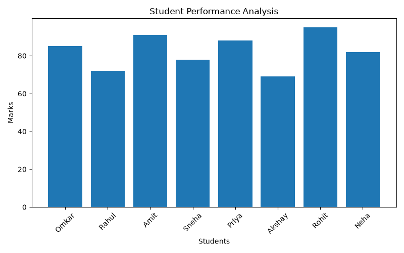

# 📊 Student Performance Analysis

A Python-based data analysis project that analyzes student marks and provides useful performance insights using Pandas and Matplotlib.

## 🚀 Features

- Displays the first 5 student records
- Calculates average marks
- Finds the highest marks
- Finds the lowest marks
- Identifies the top-performing student
- Creates data visualizations using Matplotlib

## 🛠️ Technologies Used

- Python
- Pandas
- Matplotlib
- CSV

## 📁 Project Structure

```text
student-performance-analysis/
│
├── student_performance.py
├── student_data.csv
├── Figure_1.png
├── requirements.txt
└── README.md
```
## 📈 Data Visualization

The project includes data visualization using Matplotlib to make student performance easier to understand.



## 📊 Sample Results

- Average Marks: **82.5**
- Highest Marks: **95**
- Lowest Marks: **69**
- Top Performing Student: **Rohit - 95**

## ⚙️ How to Run
### Install dependencies

```bash
pip install -r requirements.txt
```

### Run the project

```bash
python student_performance.py
```

## 📚 What I Learned

- Working with CSV datasets
- Data analysis using Pandas
- Basic statistical analysis
- Data visualization using Matplotlib
- Managing Python project dependencies
- Using Git and GitHub

## 🔮 Future Improvements

- Add grade classification
- Add subject-wise performance analysis
- Add more performance metrics
- Add interactive visualizations
- Build a student performance dashboard

## 👨‍💻 Author

**Omkar Ingale**

B.Tech Information Technology Student

- GitHub: https://github.com/omkar0033
- LinkedIn: https://www.linkedin.com/in/omkar-ingle-63b313311/
